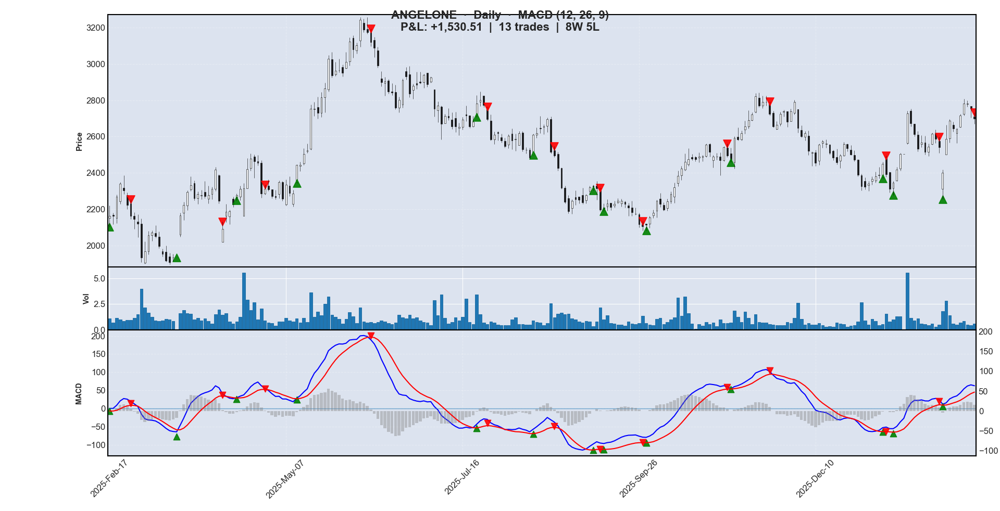
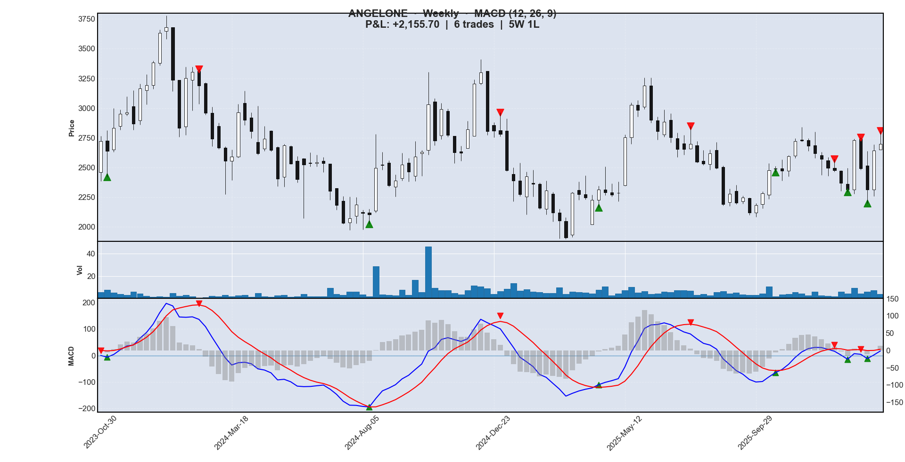
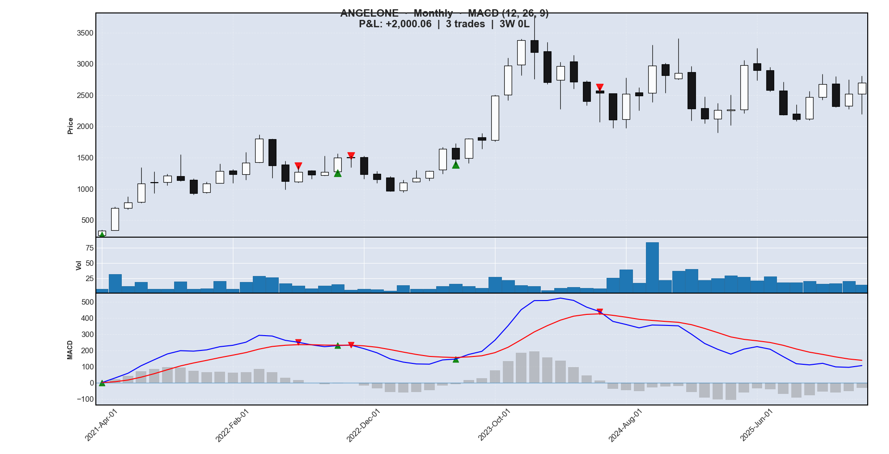

# AngelOne MACD Analysis

Technical analysis tool for **AngelOne (ANGELONE.NS)** using MACD crossover signals across daily, weekly, and monthly timeframes. Fetches live data from Yahoo Finance, simulates trades, prints a P&L log, and renders interactive candlestick charts. Work done as a part of Teacher's Assessment for Probability and Statistics - 1 at COEP Tech.

## Files

| File | Description |
|------|-------------|
| `datafetch.py` | Fetches OHLCV data from Yahoo Finance via `yfinance` |
| `macd.py` | Calculates MACD, simulates trades, and plots candlestick charts |
| `angelone_daily_365d.csv` | 365 days of daily price data |
| `angelone_weekly_120w.csv` | 120 weeks of weekly price data |
| `angelone_monthly_60m.csv` | 60 months of monthly price data |

## Setup

```bash
pip install -r requirements.txt
```

## Usage

**1. Fetch fresh data:**
```bash
python datafetch.py
```

**2. Run MACD analysis:**
```bash
python macd.py
```

Select a timeframe when prompted (Daily / Weekly / Monthly). The script prints a trade log and opens an interactive candlestick chart.

## How It Works

### MACD (12, 26, 9)
The **Moving Average Convergence Divergence** indicator is built from three components:
- **MACD line** — difference between the 12-period and 26-period exponential moving averages (EMA) of the closing price
- **Signal line** — 9-period EMA of the MACD line
- **Histogram** — difference between MACD and signal line, visualising momentum

### Trade Logic
- **Buy** — triggered when the MACD line crosses *above* the signal line (bullish crossover ▲)
- **Sell** — triggered when the MACD line crosses *below* the signal line (bearish crossover ▼)
- Trades are non-overlapping; each buy is paired with the very next sell signal

### Chart Layout
Three-panel layout per timeframe:
1. **Candlestick** — price action with buy (▲ green) and sell (▼ red) markers
2. **Volume** — bar chart
3. **MACD** — MACD line (blue), signal line (red), histogram (grey)

---

## Results

### Daily (365 days)




| Buy Date | Buy ₹ | Sell Date | Sell ₹ | P&L ₹ | % | |
|---|---|---|---|---|---|---|
| 2025-02-17 | 2162.52 | 2025-02-25 | 2164.04 | +1.52 | +0.07% | ✓ |
| 2025-03-18 | 1935.92 | 2025-04-07 | 2093.57 | +157.65 | +8.14% | ✓ |
| 2025-04-15 | 2278.27 | 2025-04-28 | 2313.45 | +35.18 | +1.54% | ✓ |
| 2025-05-12 | 2443.95 | 2025-06-10 | 3117.95 | +674.00 | +27.58% | ✓ |
| 2025-07-22 | 2780.92 | 2025-07-25 | 2696.36 | -84.56 | -3.04% | ✗ |
| 2025-08-13 | 2608.83 | 2025-08-22 | 2496.62 | -112.21 | -4.30% | ✗ |
| 2025-09-09 | 2315.62 | 2025-09-11 | 2196.66 | -118.95 | -5.14% | ✗ |
| 2025-09-12 | 2202.91 | 2025-09-29 | 2106.36 | -96.55 | -4.38% | ✗ |
| 2025-09-30 | 2113.89 | 2025-11-04 | 2496.42 | +382.53 | +18.10% | ✓ |
| 2025-11-06 | 2464.80 | 2025-11-21 | 2724.12 | +259.32 | +10.52% | ✓ |
| 2026-01-07 | 2449.04 | 2026-01-08 | 2391.55 | -57.49 | -2.35% | ✗ |
| 2026-01-12 | 2347.83 | 2026-01-30 | 2540.90 | +193.07 | +8.22% | ✓ |
| 2026-02-02 | 2401.30 | 2026-02-13 | 2698.30 | +297.00 | +12.37% | ✓ |

**Total P&L: ₹+1530.51 | Trades: 13 | Wins: 8 | Losses: 5 | Win Rate: 61.5%**

---

### Weekly (120 weeks)




| Buy Date | Buy ₹ | Sell Date | Sell ₹ | P&L ₹ | % | |
|---|---|---|---|---|---|---|
| 2023-11-06 | 2638.60 | 2024-02-12 | 3188.86 | +550.26 | +20.85% | ✓ |
| 2024-08-12 | 2103.24 | 2024-12-30 | 2780.95 | +677.71 | +32.22% | ✓ |
| 2025-04-14 | 2315.41 | 2025-07-21 | 2696.36 | +380.95 | +16.45% | ✓ |
| 2025-10-20 | 2492.56 | 2025-12-22 | 2474.02 | -18.54 | -0.74% | ✗ |
| 2026-01-05 | 2313.14 | 2026-01-19 | 2493.15 | +180.02 | +7.78% | ✓ |
| 2026-01-26 | 2313.00 | 2026-02-09 | 2698.30 | +385.30 | +16.66% | ✓ |

**Total P&L: ₹+2155.70 | Trades: 6 | Wins: 5 | Losses: 1 | Win Rate: 83.3%**

---

### Monthly (60 months)




| Buy Date | Buy ₹ | Sell Date | Sell ₹ | P&L ₹ | % | |
|---|---|---|---|---|---|---|
| 2021-04-01 | 331.32 | 2022-07-01 | 1272.10 | +940.77 | +283.94% | ✓ |
| 2022-10-01 | 1500.16 | 2022-11-01 | 1503.41 | +3.25 | +0.22% | ✓ |
| 2023-07-01 | 1477.41 | 2024-06-01 | 2533.44 | +1056.04 | +71.48% | ✓ |

**Total P&L: ₹+2000.06 | Trades: 3 | Wins: 3 | Losses: 0 | Win Rate: 100.0%**

Big thanks to Prof. Sohan Barkale for giving us the idea for the project, and for his continued guidance and support! Also a big thanks to the guys at COEP Quant Finance for their help in teaching me pandas, matplotlib, and yfinance!
